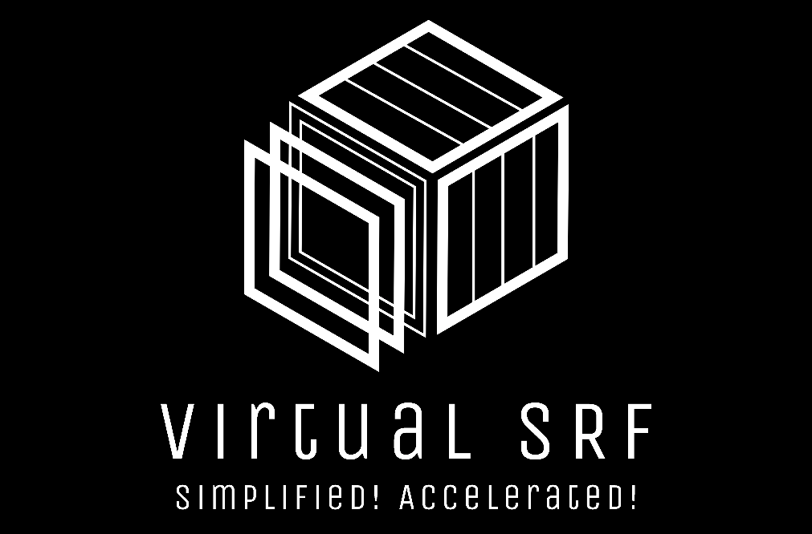

# Virtual Superconducting RF Cavity
The code of virtual superconducting cavity~

## Contributing

If you want others to contribute to the project, provide contribution guidelines and contact information.

## License

This repository is licensed under the [LICENSE](LICENSE).

## Contact

Provide contact information so users can reach out to you.

Feel free to customize this template to fit the specific needs of your project. If you have any specific requirements or need further assistance, please let me know. I'd be happy to help!

## References
Sharma, Ashish, Bhuban Kumar Sahu和Subrat Kar. 《Baseband Modeling of Superconducting RF Cavity in Digital Domain》. ECS Transactions 107, 期 1 (2022年4月24日): 15643. https://doi.org/10.1149/10701.15643ecst.

## Star History

